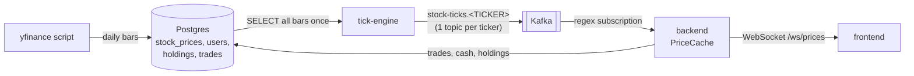
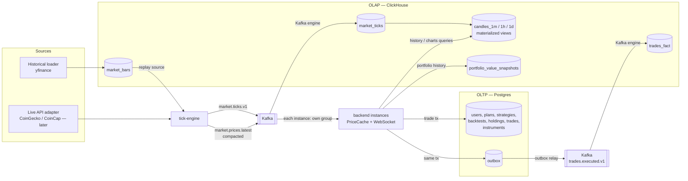
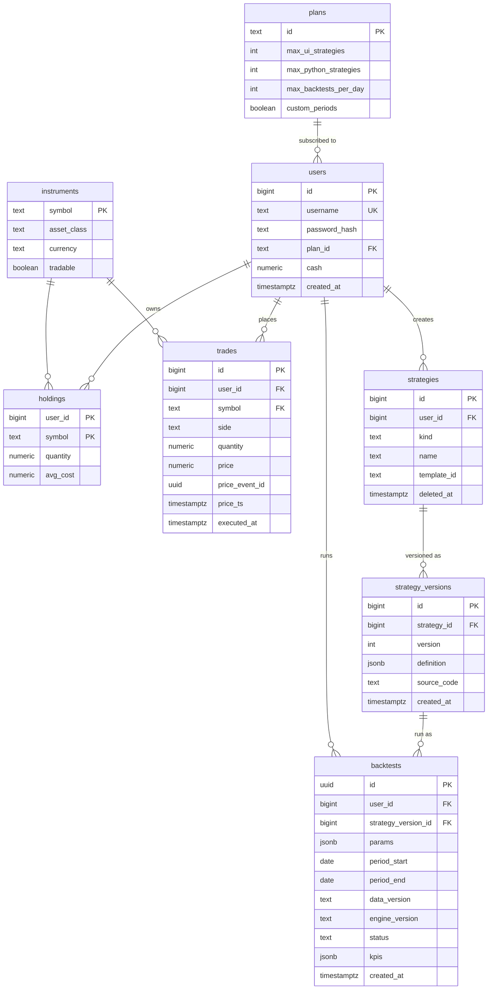

# Design Decisions — Data Pipeline

Status: **Draft for discussion** · Last updated: 2026-09-25

This document records the design decisions for the Fantasy Stock data
pipeline: how market data enters the system, how it flows through the
tick-engine and Kafka into the backend, and where it is stored. The main
change it proposes is splitting storage into an **OLTP** database (the
app's transactional state) and an **OLAP** database (time series and
analytics).

Each decision follows a light ADR format: context → decision →
consequences, with alternatives where they matter. Status values:
**Accepted** (already built), **Proposed** (agreed direction, not built),
**Open** (needs a team decision).

---

## 1. Current state (POC 1–3)



- One Postgres instance holds both the raw market data (`stock_prices`) and
  the app state (`users`, `holdings`, `trades`).
- The tick-engine loads all daily bars at startup and replays one trading
  day per `TICK_INTERVAL_SECONDS` onto one Kafka topic per ticker, looping
  forever (`lap` counter).
- The backend consumes all `stock-ticks.*` topics into an in-memory
  `PriceCache`, executes trades at the cached `close`, and pushes each tick
  to WebSocket clients.
- Schema is created by `docker-entrypoint-initdb.d` scripts, which only run
  on a fresh volume.

This is fine for the POC. It will not hold up once we add backtesting over
long histories, performance charts and more symbols (crypto), for the
reasons listed in the decisions below.

---

## 2. Target architecture



**Rule of thumb:** anything that must be *correct right now* (cash,
holdings, whether a trade may execute) lives in OLTP. Anything that is
*append-only and queried over time* (ticks, candles, trade history
analytics, portfolio value over time) lives in OLAP. Kafka is the only path
between producers and the stores; no service writes to both databases in
one code path.

---

## 3. Decisions

### DD-01 — Split storage into OLTP (Postgres) and OLAP (ClickHouse)

**Status:** Proposed

**Context.** The two workloads have opposite access patterns:

| | OLTP (app state) | OLAP (market & analytics) |
|---|---|---|
| Writes | small, concurrent, must be transactional (`SELECT … FOR UPDATE` on cash) | high-volume, append-only (every tick) |
| Reads | point lookups by user | scans and aggregations over time ranges and many symbols |
| Correctness | strict (money) | eventual is fine (seconds of lag) |
| Growth | slow (per user action) | fast (per tick × per symbol) |

Mixing both in one Postgres means tick volume and chart queries compete
with the trade path for I/O, locks and vacuum, and `stock_prices` grows
without bound next to the tables we need to keep fast.

**Decision.**
- **OLTP: PostgreSQL 16** (already in place). Holds users, plans,
  strategies, backtests (config + summary), holdings, trades,
  instruments, outbox.
- **OLAP: ClickHouse.** Holds raw bars, ticks, candles, a trade fact table
  and portfolio value snapshots.

**Why ClickHouse.** Columnar storage and `MergeTree` ordering by
`(symbol, ts)` make time-range aggregations cheap; materialized views build
candles incrementally at insert time; and its built-in **Kafka table
engine** can consume our topics directly, so we don't need to write and
operate a separate sink service.

**Alternatives considered.**
- **TimescaleDB** (Postgres extension). Lowest friction: same SQL, same
  Npgsql driver, continuous aggregates for candles. It is the fallback if
  running a second database technology turns out to be too much for the
  team. Downside: it's still row-oriented Postgres underneath and has no
  native Kafka ingestion, so we'd need a sink (Kafka Connect or a small
  .NET consumer).
- **DuckDB / Parquet files.** Great for offline analysis, but it's an
  embedded, single-writer engine, so it can't serve concurrent queries from
  the backend.
- **Keep one Postgres.** Simplest, but see context above.

**Consequences.**
- One more container in `docker-compose.yml` (`clickhouse/clickhouse-server`,
  ports 8123/9000) and one more driver in the backend (`ClickHouse.Client`).
- Two connection strings. Env vars get renamed to `OLTP_*` / `OLAP_*` to
  keep them apart.
- Data in OLAP is **derived** and can be rebuilt by replaying Kafka or
  reloading the source. OLTP is the **system of record** and is what gets
  backed up.

---

### DD-02 — Market data ownership: raw bars move to OLAP; the tick-engine reads from a source adapter

**Status:** Proposed

**Context.** Today the tick-engine reads `stock_prices` from the same
Postgres the backend writes trades to. Historical bars are time-series data
that nothing in the trade path needs.

**Decision.**
- The historical loader (`scripts/fetch_stock_data.py`) writes to
  `olap.market_bars` instead of Postgres.
- The tick-engine gets an `IPriceSource` abstraction with two
  implementations:
  - `ReplaySource`: reads `market_bars` from ClickHouse (today's behavior).
  - `LiveSource`: polls a public API such as CoinGecko or CoinCap (MVP goal
    per the README).
- The rest of the pipeline doesn't know or care which source is active.

**Consequences.** Postgres no longer contains any market data. The switch
from simulated to live prices becomes a config change instead of a rewrite.

---

### DD-03 — Kafka topics: one topic per data type, keyed by symbol (not one topic per ticker)

**Status:** Proposed (replaces the current `stock-ticks.<TICKER>` layout)

**Context.** One topic per ticker plus a regex subscription has problems:
- **New tickers show up late.** librdkafka only rediscovers topics matching
  a regex every `topic.metadata.refresh.interval.ms` (default: 5 minutes).
- **It relies on `KAFKA_AUTO_CREATE_TOPICS_ENABLE=true`**, which also
  silently creates topics from typos.
- **It doesn't scale to crypto.** Every topic carries per-partition
  overhead, so thousands of symbols means thousands of topics.
- **No ordering across symbols.** Topics are independent, so consumers
  can't tell that one "tick" of the simulated clock covers all symbols.

**Decision.**

| Topic | Key | Partitions | Retention | Producer → Consumers |
|---|---|---|---|---|
| `market.ticks.v1` | symbol | 6 | 7 days (delete) | tick-engine → backend, ClickHouse |
| `market.prices.latest` | symbol | 6 | compacted | tick-engine → backend (cache warm-up) |
| `trades.executed.v1` | user id | 6 | 30 days (delete) | outbox relay → ClickHouse, future notifications |

- Keying by symbol keeps all ticks for one symbol in order within a
  partition.
- Topics are created explicitly, by an init container or script in
  compose, and auto-create is turned **off**.
- The `.v1` suffix gives us a clean way to make breaking schema changes
  (DD-04).

---

### DD-04 — Event envelope and schema versioning

**Status:** Proposed

**Context.** The current payload has no event id, no real timestamp (only
`trade_date` plus a `lap` counter), and no version. Consumers can't
deduplicate, order by time, or detect a format change.

**Decision.** Every event carries a common envelope:

```json
{
  "event_id":   "0192f7c1-…",              // UUID v7, unique per event → idempotency key
  "event_type": "market.tick",
  "schema_version": 1,
  "event_ts":   "2026-09-25T14:03:05.120Z", // market time the price is valid for
  "produced_ts":"2026-09-25T14:03:05.131Z", // wall clock at the producer
  "source":     "replay",                   // replay | coingecko | …
  "data": {
    "symbol": "AAPL",
    "price":  171.48,
    "open": 170.10, "high": 172.00, "low": 169.80, "volume": 51234000
  }
}
```

- Replay mode maps each replayed bar onto a **simulated market clock**, so
  `event_ts` always moves forward. That replaces `lap`.
- Stay on JSON for now and document the contract in `docs/contracts/`.
  Revisit **Avro or Protobuf with a Schema Registry** once there is more
  than one team or language producing events.
- Rules for changes: adding optional fields is fine within a version;
  renaming or removing a field means a new `.vN` topic.
- All timestamps are UTC. Use `TIMESTAMPTZ` in Postgres and
  `DateTime64(3, 'UTC')` in ClickHouse.

---

### DD-05 — Delivery guarantees: at-least-once everywhere, idempotent sinks

**Status:** Proposed

**Decision.**
- **Producers:** `enable.idempotence=true` and `acks=all`, which prevents
  duplicates caused by producer retries.
- **Consumers:** at-least-once delivery. Commit offsets after processing.
- **Sinks:** must tolerate duplicates.
  - ClickHouse tables that need exact counts use `ReplacingMergeTree`
    keyed by `event_id`.
  - The backend's `PriceCache` ignores a tick whose `event_ts` is older
    than the one it already has, so a replayed or reordered message can't
    move the price backwards.
- We deliberately don't use Kafka transactions / exactly-once: they add
  complexity that idempotent sinks make unnecessary here.

---

### DD-06 — Backend price consumption: per-instance consumer group + compacted snapshot topic

**Status:** Proposed. This fixes two latent bugs in the current setup.

**Context.**
1. `KafkaConsumerService` uses a fixed `GroupId = "backend-consumer"`. If
   we run **two backend replicas**, Kafka splits the partitions between
   them, so each instance only sees *some* symbols. Its `PriceCache` and
   WebSocket feed are then incomplete, and trades on the missing symbols
   fail with "no price data yet".
2. With `AutoOffsetReset.Latest`, a restarted backend has an empty cache
   until the next tick for each symbol arrives (open question 2 in
   `poc-3-status.md`).

**Decision.**
- Each backend instance consumes with its **own group id**, for example
  `backend-<hostname>`, or uses manual partition assignment with no group.
  Every instance must see every tick. This is fan-out, not work-sharing.
- On startup, each instance first reads `market.prices.latest` (compacted,
  so it holds one latest message per symbol) from the beginning to warm the
  cache, then switches to `market.ticks.v1` from `latest`.
- The backend only reports itself **ready** (a readiness probe separate
  from `/health`) once the cache has been warmed.

**Alternative.** A shared Redis cache for latest prices. Rejected for now:
it adds another piece of infrastructure, and the compacted topic already
gives us the same thing.

---

### DD-07 — Trade write path: OLTP transaction + transactional outbox → Kafka → OLAP

**Status:** Proposed

**Context.** Analytics (trade history charts, portfolio value over time) need
trades in OLAP. Writing to Postgres *and* publishing to Kafka from the same
request is a **dual write**: if either one fails, the two stores disagree.

**Decision.**
- `TradingService` keeps its current transaction (lock user → validate →
  update cash/holdings → insert trade).
- In the **same transaction** it inserts a row into `outbox`
  (`id, aggregate, event_type, payload jsonb, created_at, published_at`).
- An **outbox relay** publishes unpublished rows to `trades.executed.v1`
  and marks them published. Start with a simple hosted service in the
  backend that polls with `FOR UPDATE SKIP LOCKED`. Move to Debezium CDC if
  the load or the number of event types grows.
- ClickHouse ingests `trades.executed.v1` into `trades_fact`.

**Consequences.** A trade is committed if and only if its event will
eventually be published. OLAP lags OLTP by about a second, which is
acceptable because nothing in OLAP is used to decide whether a trade may
execute.

---

### DD-08 — OLTP schema: user-centric, no leagues

**Status:** Proposed. Leagues were dropped on 2026-09-25, see
[requirements.md](requirements.md) D2.

**Context.** The product is now a backtesting platform for individual
users. There are no leagues, so cash, holdings, strategies and backtests
all belong directly to a user. The existing `users.cash` column stays
where it is.

**Decision.**



Notes:
- `strategies.kind` is `template_config`, `ui` or `python`. The free-tier
  quota (1 UI + 1 Python, FR-STR-09) counts active rows (`deleted_at IS
  NULL`) per user and kind, against the `plans` limits. It is checked
  inside the insert transaction with a row lock on the user, the same
  pattern `TradingService` uses for cash, so two parallel requests can't
  both take the last slot.
- A UI strategy stores its rule tree in `definition`. A Python strategy
  stores its code in `source_code`. Versions are immutable, and every
  backtest points at exactly one version (reproducibility, NFR-04).
- Only summary `kpis` live in OLTP, for listing and sorting. Daily equity
  and backtest trades go to OLAP (DD-10).
- `holdings` / `trades` only serve the paper-trading path and stay
  per-user.
- `CHECK (cash >= 0)` and `CHECK (quantity >= 0)` as a last line of
  defense in the database, behind the application checks.
- `trades.price_event_id` / `price_ts` record *which tick* a trade executed
  against, so every fill can be audited.
- `avg_cost` on holdings allows unrealized P/L without scanning all trades.
- Money stays `NUMERIC`, never floating point.
- `instruments` replaces free-text tickers and controls what is tradable.

---

### DD-09 — Schema migrations instead of `initdb` scripts

**Status:** Proposed

**Context.** `db/*.sql` scripts in `docker-entrypoint-initdb.d` only run on
a fresh volume. This already caused manual `psql` steps and the sequence
bug fixed in `03_auth_schema.sql`.

**Decision.** Use a versioned migration tool that the backend runs at
startup, or that runs as a one-shot compose service before the backend
starts:
- **OLTP:** DbUp or EF Core migrations (we're on .NET), or Flyway if we
  want one tool for both databases.
- **OLAP:** plain numbered `.sql` files applied by the same runner,
  tracked in a `schema_migrations` table.

Use `GENERATED ALWAYS AS IDENTITY` instead of `SERIAL`, and don't seed
explicit ids.

---

### DD-10 — OLAP schema

**Status:** Proposed

| Table | Engine / ordering | Fed by | Used for |
|---|---|---|---|
| `market_bars` | `ReplacingMergeTree` `ORDER BY (symbol, bar_date)` | historical loader | tick-engine replay source |
| `market_ticks` | `MergeTree` `ORDER BY (symbol, event_ts)`, `PARTITION BY toYYYYMM(event_ts)`, TTL 90 days | Kafka engine ← `market.ticks.v1` | raw history, rebuilding candles |
| `candles_1m`, `candles_1h`, `candles_1d` | `AggregatingMergeTree` via materialized views | `market_ticks` | price charts |
| `trades_fact` | `ReplacingMergeTree(event_id)` `ORDER BY (user_id, executed_at)` | Kafka engine ← `trades.executed.v1` | paper-trading analytics |
| `portfolio_value_snapshots` | `MergeTree` `ORDER BY (user_id, ts)` | periodic job (see DD-11) | paper-trading performance chart |
| `backtest_equity` | `ReplacingMergeTree` `ORDER BY (backtest_id, date)` | backtest workers | equity curve, drawdown chart |
| `backtest_trades` | `ReplacingMergeTree` `ORDER BY (backtest_id, entry_date, symbol)` | backtest workers | trade list, buy/sell markers |

Ingestion pattern (per topic): `ENGINE = Kafka` table → `MATERIALIZED
VIEW` → target `MergeTree` table. The Kafka table's consumer group is
separate from the backend's, so ClickHouse and the backend read the stream
independently.

---

### DD-11 — Read-path split: which query goes where

**Status:** Proposed

| Feature | Source | Why |
|---|---|---|
| Current price, trade execution | backend `PriceCache` (from Kafka) | lowest latency, no DB round-trip |
| Cash, holdings, "can I trade?" | OLTP | must be exactly correct |
| Live portfolio value | backend: OLTP holdings × `PriceCache`, pushed over WebSocket | meets the < 2 s latency goal |
| Price charts / candles | OLAP `candles_*` | range aggregations |
| Portfolio value over time | OLAP `portfolio_value_snapshots` | time series |
| Own trade list (recent) | OLTP | small, per-user, needs to show immediately after a trade |
| Stats (most traded, win rates, …) | OLAP `trades_fact` | aggregations |
| Strategy list, backtest list + summary KPIs, quotas | OLTP `strategies`, `backtests` | small, per-user, sortable |
| Backtest equity curve, drawdown, trade list | OLAP `backtest_equity`, `backtest_trades` | per-day series, can be large |
| Backtest input data | OLAP `market_bars` | range scans by symbol and period |

**Portfolio snapshots.** A backend hosted service writes one snapshot per
user every N seconds (e.g. 60), and one per tick-engine "trading day" in
replay mode. They are published as `portfolio.snapshots.v1` and ingested
the same way as the other topics, so the backend never writes to OLAP
directly.

---

### DD-12 — Trade execution price rules

**Status:** Proposed

- Trades execute at the latest cached price (market orders only, per MVP
  scope).
- **Staleness guard:** reject the trade if the cached tick's `event_ts` is
  older than a threshold, e.g. 3 × tick interval. This stops trades
  against a frozen feed when the tick-engine is down.
- The executed price and its `price_event_id` are stored on the trade
  (DD-08).
- **Replay mode caveat:** when the tick-engine loops, the price jumps back
  to day 1. Paper trading should either run on live data, or on a replay
  long enough that it doesn't loop in practice.

---

### DD-13 — Tick granularity in replay mode

**Status:** Open

Replaying one **daily** bar per tick makes prices jump once per interval
and makes `open/high/low` meaningless for trading. Options:

1. **Load intraday bars** (yfinance offers 1-minute bars for the last ~30
   days) and replay them. Realistic, but a limited history window.
2. **Synthesize intraday ticks** from daily OHLC, e.g. a Brownian bridge
   through O → H/L → C, emitting several ticks per simulated day.
   Unlimited history and smooth charts, but the intraday path is made up.
3. **Keep daily bars.** Simplest option and fine for a demo.

Suggested: option 2 for replay mode, since live mode (DD-02) gives real
granularity anyway.

---

### DD-14 — Operability

**Status:** Proposed

- **Health / readiness:** every service exposes liveness; the backend's
  readiness also depends on cache warm-up (DD-06).
- **Metrics to watch:**
  - consumer lag per group (backend instances, ClickHouse)
  - tick-engine produce rate
  - outbox backlog (`published_at IS NULL` count)
  - end-to-end latency, `produced_ts` → WebSocket send, against the < 2 s
    success metric
- **Kafka UI** container (e.g. `provectuslabs/kafka-ui`) in compose for
  local debugging.
- **Backups:** OLTP only. OLAP is rebuildable (DD-01).

---

## 4. Open questions

1. **ClickHouse vs. TimescaleDB (DD-01).** Is the team comfortable
   operating a second database technology, or do we take the
   lower-friction Timescale path?
2. **Tick granularity (DD-13).** Daily, synthesized intraday, or real
   intraday bars?
3. **Outbox relay.** In-process poller now, Debezium later: agreed?
4. **Retention.** How long do we keep raw ticks once candles exist?
   (Proposed: 90 days.)

## 5. Suggested migration order

1. Migration tooling + OLTP schema for plans, strategies and backtests
   (DD-08, DD-09).
2. New Kafka topic layout + envelope, with explicit topic creation (DD-03,
   DD-04, DD-05).
3. Backend consumer fixes: per-instance group, compacted warm-up,
   staleness guard (DD-06, DD-12).
4. Add ClickHouse; move `market_bars`; tick-engine `ReplaySource` (DD-01,
   DD-02, DD-10).
5. Outbox + `trades.executed.v1` → `trades_fact` (DD-07).
6. Portfolio snapshots + chart/history endpoints on OLAP (DD-11).
